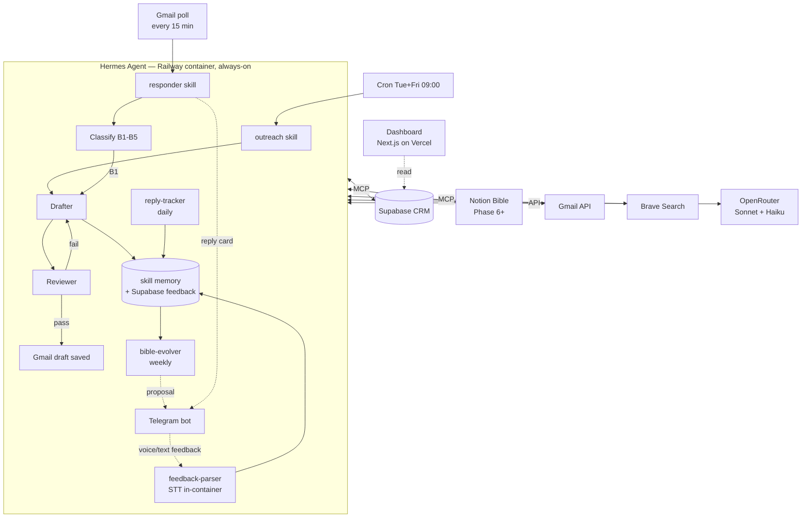
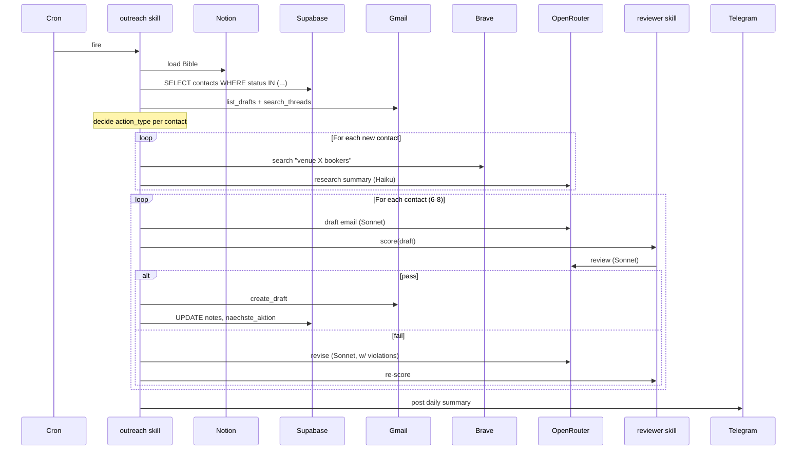
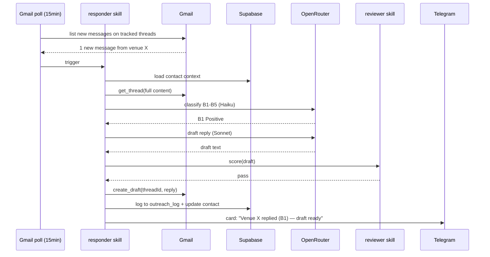
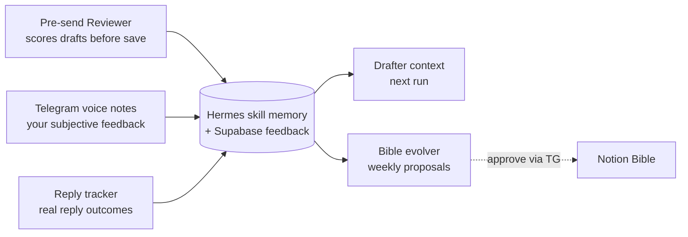

# Kon Faber Outreach Agent — Architecture (v2.1)

_v2.1 • 2026-05-14 — added Responder skill, Dashboard, llm_calls table_

Supersedes [03-architecture.md](../project-docs/03-architecture.md).

## One-picture overview



## Deployment topology

**One Railway project, two services** (revised per user pref — wants to learn Railway):

| Service | What | Image |
|---|---|---|
| `kon-faber-agent` | Hermes container, always-on | Custom Dockerfile (python:3.12-slim) |
| `kon-faber-dashboard` | Next.js dashboard | Custom Dockerfile or Railpack auto-detect |

Inter-service: dashboard reads Supabase directly (not from the agent). No private networking needed between them.

| Item | Config |
|---|---|
| Source | Docker image: custom-built from `python:3.12-slim` + Hermes Agent installed |
| Runtime | Hermes Agent v0.2+ |
| Always-on | Yes — needed for Telegram listener |
| Persistent volume | `/data` — mounts Hermes memory store, skill registry, sqlite |
| Public networking | None — Hermes Telegram uses polling (no inbound webhook needed). Optional: enable HTTPS proxy later if we add a webhook UI. |
| Plan | Hobby ($5/mo + tiny compute) |
| Cron | Hermes built-in (defined in skill config) |
| Restart policy | Always restart on failure |

**Why not Modal:** Modal charges per second. A 24/7 Telegram listener is exactly the workload Modal is bad at. Railway's flat compute is the right shape.

## Skill design (Hermes)

Hermes calls them **skills**. We compose six:

### 1. `outreach` (main scheduled skill)
- **Trigger:** cron (Tue + Fri 09:00 Berlin) OR Telegram command `/outreach [N]`
- **Source of truth:** Your existing `SKILL.md` (`daily-outreach-drafts`) — ported as-is
- **Steps:** load Bible → query CRM → Gmail state check → research new contacts → draft → review → save → update CRM → summary to Telegram
- **Tools:** Supabase MCP, Notion MCP (Phase 6+) or bible-snapshot.md (Phase 1-5), Gmail MCP, Brave Search
- **Models:** Haiku for SQL/Gmail-state, Sonnet for drafting + reviewer

### 2. `responder` (event-driven reply skill) ★ NEW
- **Trigger:** Gmail polling (15-min interval) for new inbound messages on threads we initiated
- **Steps:**
  1. Detect new message on a tracked thread
  2. Load thread context + contact CRM data + relevant Bible section
  3. Classify per SKILL.md §2.5b (B1 Positive / B2 Re-Route / B3 Negative / B4 OOO / B5 Unclear)
  4. Branch:
     - **B1** → draft warm reply in thread → run through `reviewer` → save as Gmail draft
     - **B2/B5** → no draft, post summary card to Telegram for human triage
     - **B3** → CRM `MARK_DECLINED`, Telegram FYI
     - **B4** → CRM `SKIP_OOO`, set `naechste_aktion` to OOO-end + 1, Telegram FYI
  5. Post Telegram card: who, bucket, summary, draft link if any
- **Anti-duplicate:** skip if our reply already exists in the thread
- **Models:** Haiku for classification, Sonnet for B1 reply drafting

### 3. `reviewer` (sub-skill, called by `outreach` and `responder`)
- **Input:** a draft + the contact + relevant Bible section + touch number
- **Output:** `{ pass: bool, score: float, violations: [...] }`
- **Rules:** Per SKILL.md §4d — em-dashes, AI-pattern linter, length caps, exact self-description, tone, hyperbole, equipment lists
- **Model:** Sonnet (small context, fast) — one call per draft

### 4. `feedback-parser` (event-driven, on Telegram voice/text)
- **Input:** transcribed voice note or text message
- **Output:** structured lesson — `{ scope, content, target_draft_id? }`
- **Side effect:** stored in Hermes skill memory + Supabase `feedback` table
- **Model:** Haiku — cheap classification

### 5. `reply-tracker` (daily cron, statistical, ≠ responder)
- **Trigger:** daily 21:00 Berlin
- **Distinction from responder:** Responder handles each reply in real-time; reply-tracker aggregates outcomes statistically for the Bible evolver
- **Action:** scan Gmail for new replies; attribute to template/touch; update `outreach_log` reply data
- **Model:** Haiku for classification

### 6. `bible-evolver` (weekly cron)
- **Trigger:** Sundays 18:00 Berlin
- **Action:** aggregate weekly reply rates + feedback lessons → propose Bible edits → send to Telegram with approve/reject → if approved, write to Notion (Phase 6+)
- **Model:** Sonnet for proposal, Haiku for diff

## Container build

```dockerfile
FROM python:3.12-slim

RUN apt-get update && apt-get install -y \
    ffmpeg \  # for faster-whisper audio decoding
    git \
    && rm -rf /var/lib/apt/lists/*

# Install Hermes
RUN pip install --no-cache-dir hermes-agent

# Install faster-whisper for local STT
RUN pip install --no-cache-dir faster-whisper

WORKDIR /app
COPY skills/ /app/skills/
COPY hermes.config.yaml /app/

VOLUME ["/data"]

CMD ["hermes", "run", "--config", "/app/hermes.config.yaml"]
```

(Exact package names verified at install time — Hermes' pip name may differ.)

## Dashboard architecture ★ NEW

### Stack
- **Next.js 15** (App Router) on **Vercel free tier**
- **Tremor.so** for charts + KPI cards (designed for dashboards, beautiful defaults)
- **Tailwind CSS** for layout
- **shadcn/ui** for components (buttons, dialogs, command palette)
- Reads from **Supabase** directly using a service role key (server-side only — never exposed to browser)
- Single password gate via env var → httpOnly cookie session

### Views

| View | Content |
|---|---|
| **Today** | KPI cards: this week's drafts, replies received, current pipeline count, MTD spend. Recent activity feed (last 20 events). |
| **Activity** | Filterable timeline: runs, drafts, replies, voice-note lessons, errors. Each row links to the relevant Gmail thread or Supabase row. |
| **Cost** | Month-to-date spend, by model, by skill (outreach/responder/reviewer/etc.), with simple line chart over time. Projection for the month. |

### Why Railway (not Vercel) for the dashboard
- **You want to learn Railway** — building two services in one project is a great way to do that
- **Cost overhead is small** (~€5/mo extra) and worth it for the learning
- Still **decoupled from Hermes** — separate service, independent deploys
- Can move to Vercel later if cost matters more than learning

### Why not a Telegram-only dashboard
- Easy to skip looking at a Telegram command summary
- A real URL on your phone home screen is harder to ignore
- Charts beat text for cost trends

## Data flow — scheduled outreach run



## Data flow — event-driven reply (responder skill) ★ NEW



## Learning loop — three feedback streams, one memory



Three streams, three timescales:
- **Reviewer**: per-draft, immediate (catches obvious rule violations)
- **Voice notes**: per-run, daily (your taste/judgment)
- **Reply tracker**: per-week, statistical (ground truth)

All three converge in skill memory. Drafter reads recent lessons for next run's context. Weekly, the Bible evolver consolidates patterns and proposes constitutional changes.

## CRM schema additions

To existing `contacts` table (UUID id), add four small tables:

```sql
-- Hermes lessons (mirrored from skill memory for queryability)
CREATE TABLE feedback (
    id BIGSERIAL PRIMARY KEY,
    source TEXT NOT NULL,           -- 'reviewer' | 'voice' | 'reply_tracker'
    scope TEXT NOT NULL,            -- 'tone' | 'hook' | 'contact' | 'skip'
    content TEXT NOT NULL,
    contact_id UUID REFERENCES contacts(id),
    draft_id TEXT,                   -- Gmail draft id when applicable
    created_at TIMESTAMPTZ DEFAULT now()
);

-- Track which template/touch went out and what came back
CREATE TABLE outreach_log (
    id BIGSERIAL PRIMARY KEY,
    contact_id UUID REFERENCES contacts(id),
    touch INT NOT NULL,              -- 1, 2, 3, or 'reply'
    template_id TEXT NOT NULL,
    action_type TEXT NOT NULL,       -- from SKILL.md (TOUCH_1_FRESH, REPLY_DRAFT_B1, etc.)
    draft_id TEXT,
    thread_id TEXT,
    sent_at TIMESTAMPTZ,
    reply_at TIMESTAMPTZ,
    reply_bucket TEXT,               -- 'B1' | 'B2' | 'B3' | 'B4' | 'B5'
    created_at TIMESTAMPTZ DEFAULT now()
);

-- LLM cost tracking — powers the dashboard cost view
CREATE TABLE llm_calls (
    id BIGSERIAL PRIMARY KEY,
    skill TEXT NOT NULL,             -- 'outreach' | 'responder' | 'reviewer' | etc.
    model TEXT NOT NULL,             -- 'anthropic/claude-sonnet-4.5' etc.
    input_tokens INT NOT NULL,
    output_tokens INT NOT NULL,
    cost_usd NUMERIC(10,6) NOT NULL, -- computed at log time using OpenRouter pricing
    run_id TEXT,                     -- groups calls within one skill invocation
    contact_id UUID REFERENCES contacts(id),
    created_at TIMESTAMPTZ DEFAULT now()
);

-- Aggregate stats for the bible evolver and dashboard
CREATE VIEW template_performance AS
SELECT
    template_id,
    touch,
    COUNT(*) AS sent,
    COUNT(reply_at) AS replies,
    AVG(CASE WHEN reply_bucket = 'B1' THEN 1.0 ELSE 0.0 END) AS positive_rate
FROM outreach_log
WHERE sent_at IS NOT NULL
GROUP BY template_id, touch;

CREATE VIEW spend_by_day AS
SELECT
    DATE(created_at AT TIME ZONE 'Europe/Berlin') AS day,
    skill,
    SUM(cost_usd) AS spend
FROM llm_calls
GROUP BY day, skill;
```

## Security & secrets

- All API keys in Railway env vars — never committed
- Gmail OAuth refresh token: stored in Hermes' encrypted secret store + mirrored in Supabase `oauth_tokens` (encrypted with pgcrypto)
- Telegram bot token: env var only; bot uses long-polling so no public webhook to secure
- Supabase service key (not anon) — only the agent has it; never exposed to Telegram
- Hard timeout per skill invocation: 5 minutes (prevents runaway costs)
- Daily LLM spend cap: €1/day (alerts to Telegram if hit, suspends until next day)

## Cost levers (recap)

| Lever | Impact |
|---|---|
| Run frequency 7→2/week | −71% LLM cost |
| Sonnet only for drafting; Haiku for everything else | −60% on non-drafting calls |
| Brave Search free tier | Saves ~€5/mo vs paid |
| Local faster-whisper STT | Saves ~€2/mo vs Whisper API |
| Cache venue research per contact | Avoids re-researching, ~−20% over time |
| Skip research for high-priority known contacts | ~−10% |
| Reviewer max 2 revision passes | Caps worst-case spend per draft |

## Tech stack

| Layer | Choice |
|---|---|
| Agent framework | **Hermes Agent v0.2+** (NousResearch) |
| Language | **Python 3.12** (Hermes native) |
| LLM gateway | **OpenRouter** ✅ confirmed |
| LLMs | Sonnet 4.5 (drafting, reviewer, B1 replies) + Haiku 4.5 (queries, classification) |
| STT | **faster-whisper** local (free) |
| Search | **Brave Search** (free tier 2k/mo) |
| Messaging | **Telegram Bot API** |
| CRM | **Supabase** (existing) |
| Bible | **bible-snapshot.md** (v1-5) → **Notion** (Phase 6+) |
| Email | **Gmail API** OAuth (existing) |
| Reply detection | **Gmail polling (15-min)** → optional upgrade to Pub/Sub push later |
| Agent hosting | **Railway Hobby** (~€5-10/mo + small compute) |
| Container | **Docker** (python:3.12-slim base) |
| **Dashboard hosting** | **Railway** (second service in same project) |
| **Dashboard framework** | **Next.js 15** + **Tremor.so** + **Tailwind** + **shadcn/ui** |
| Observability | **Hermes built-in** + our own `llm_calls` table for cost (LangFuse only if needed later) |

## Decision log

| Decision | Why |
|---|---|
| Hermes over Craft Agents | User wants to learn Hermes; native self-improvement loop fits the learning goal |
| Railway over Modal | Always-on Telegram listener is wrong shape for Modal; Railway flat rate is right |
| OpenRouter over Anthropic-direct | Easy model swapping for cost; fallback model providers in one place |
| Tiered Sonnet/Haiku | Drafting is creative (Sonnet); SQL/classification is structured (Haiku) — ~3x savings |
| Local faster-whisper STT | Free; runs in the container; sufficient quality for personal voice notes |
| Single Hermes container vs multi-service | Single-purpose use case → YAGNI on splitting |
| Bible evolution requires approval | Prevents silent drift in agent's "constitution" |
| Brave Search over Exa | Cheaper; venue research doesn't need deep semantic search |
| Gmail Drafts (not auto-send) | You stay in the loop; reduces blast radius of bad drafts |
| Reviewer on every draft | One Sonnet call (~$0.01) saves you from sending broken emails |
| **Responder as separate skill (not part of outreach)** | Reply latency matters; cron is too slow for warm leads |
| **Dashboard on Railway (not Vercel)** | User wants to learn Railway; small cost overhead worth the learning |
| **Next.js + Tremor over Streamlit** | "Really modern UI" requirement; Tremor is dashboard-native |
| **15-min Gmail polling over Pub/Sub** | Simpler v1; push notifications add Google Cloud setup overhead |
| **Notion deferred to Phase 6** | Bible snapshot is enough until we're ready to wire it; lower v1 risk |
| **Existing SKILL.md ported, not rewritten** | 293 lines already encode the full workflow + B1-B5 classification |
| **Two-table approach: outreach_log + llm_calls** | Separates "what we did" from "what it cost"; both joined for dashboard |

## What we are **not** building

- Auto-send (you always review)
- Multi-user / multi-band
- A general-purpose assistant
- Real-time human chat with the agent (agent is async, scheduled + event-driven)
- Dashboard actions (read-only — no buttons that trigger agent runs from the UI)
- TTS replies from the agent (could come in Phase 7)
- Gmail Pub/Sub push notifications (Phase 7+ if 15-min polling proves insufficient)
