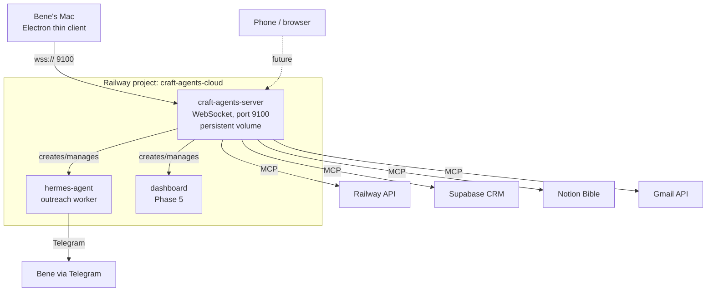

# Plan v3 — Craft Agents First

_2026-05-15 — clean restart based on Phase 0/1 learnings_

This supersedes the previous v2.x plans. The order changes: we deploy **Craft Agents OSS** on Railway *first*, connect Bene's local desktop app to it as a thin client, and then orchestrate everything else (Hermes, MCPs, outreach skill) from within that remote Craft Agents instance.

## Why this order

Previous attempt deployed Hermes directly, which forced us to manage every detail (Dockerfile, env vars, OAuth dances, MCP configs) via Railway's UI or by SSH'ing into the container. That's brittle and tiring.

With Craft Agents on Railway as the **control plane**, we get:

- A single agent UI for managing all subsequent deployments (Hermes, dashboards, future services)
- Long-running sessions that survive Mac reboots / network changes
- All workspaces, sources, skills, sessions live in one persistent place
- The remote Craft Agent can drive Railway via its MCP (we already have it configured) and `gh`, `docker`, etc. — meaning further deployments happen autonomously
- Bene chats from the Mac desktop app as a thin client — same UX, server-side persistence

We treat Hermes as a **payload** the remote Craft Agent deploys and manages, not the foundation.

## Architecture



## Lessons from Phase 0 we're applying

1. **Build from our own Dockerfile via GitHub source**, not from a public image with start-command overrides. (Railway's Custom Start Command replaces ENTRYPOINT and we lose container setup logic.)
2. **Auto-config via env vars at container start**, not via manual SSH-and-config. A startup script reads env vars and configures the service before launching the daemon.
3. **Persistent volume for runtime state only** (`/root/.craft-agent`), never for image-baked files. Image-baked stuff lives at `/opt/agent/` or similar, *outside* the volume mount path.
4. **GitHub repo is the source of truth.** Every config change → git commit → push → Railway auto-rebuilds. No clicking variables into UIs.
5. **OAuth flows happen once and store refresh tokens.** Accept they need a browser click; minimise the count.
6. **Use the Railway CLI / API for everything**, not the UI. `railway variables --set ...` instead of clicking.

---

## Phase 0 — Deploy Craft Agents OSS on Railway (~2 hours)

**Goal:** `craft-cli ping` from Bene's Mac returns success, hitting the remote Railway-hosted server.

### Repo setup

- [ ] New private GitHub repo `benji2667/craft-agents-cloud`
- [ ] Add `Dockerfile` (FROM `node:20` or build script per craft-agents-oss requirements — read repo for exact spec)
- [ ] Add `startup.sh` that reads env vars and starts the server with correct flags
- [ ] Add `.env.example` with all required vars documented
- [ ] Add `README.md` with one-shot deploy instructions

### Required env vars

```env
CRAFT_SERVER_TOKEN=<openssl rand -hex 32>   # bearer auth
CRAFT_RPC_HOST=0.0.0.0                       # bind on all interfaces (Railway needs this)
CRAFT_RPC_PORT=9100                          # default
# TLS: handled by Railway's automatic HTTPS proxy → we use ws:// internally,
# Bene's app uses wss:// via Railway's public hostname
ANTHROPIC_API_KEY=<key>                      # Craft Agents needs an LLM
# Future: provider-specific keys (OpenAI, etc.) as needed
```

### Railway setup (via CLI, not UI)

```bash
# 1. Create new project
railway init --name craft-agents-cloud

# 2. Link the GitHub repo
railway link --repo benji2667/craft-agents-cloud

# 3. Set variables in one shot from .env file
railway variables --set "CRAFT_SERVER_TOKEN=$(openssl rand -hex 32)" \
                  --set "CRAFT_RPC_HOST=0.0.0.0" \
                  --set "CRAFT_RPC_PORT=9100" \
                  --set "ANTHROPIC_API_KEY=$ANTHROPIC_API_KEY"

# 4. Add persistent volume
# (Currently UI-only — but a one-time click)

# 5. Generate public domain
railway domain
```

### Verify

```bash
export CRAFT_SERVER_URL=wss://craft-agents-cloud-production.up.railway.app
export CRAFT_SERVER_TOKEN=<the token>
craft-cli ping
```

**Done when:** `ping` returns `pong` and the persistent volume has the initial Craft Agents data folder.

---

## Phase 1 — Connect Bene's Desktop App as Thin Client (~30 min)

**Goal:** Bene opens his local Craft Agents app, it connects to the remote server, and creating a session locally creates it on the remote.

### Steps

- [ ] Bene exports env vars in his shell config (`~/.zshrc`):
  ```
  export CRAFT_SERVER_URL=wss://craft-agents-cloud-production.up.railway.app
  export CRAFT_SERVER_TOKEN=<token from SECRETS.local.md>
  ```
- [ ] Launch the Craft Agents desktop app — it picks up the env vars and connects as thin client
- [ ] Verify: a new session created locally appears in `craft-cli sessions` against the remote
- [ ] Migrate the existing `my-workspace` from local to remote (optional, but tidy)

**Done when:** A session created on the Mac is visible and persists on the remote server.

---

## Phase 2 — Wire MCPs into Remote Craft Agents (~1 hour)

**Goal:** The remote Craft Agents has all the integrations the outreach project needs.

From inside a session on the remote server (Bene's UI, same as before — just the work happens on Railway):

- [ ] **Railway MCP** — already configured in the workspace; retry OAuth via the remote (the failing earlier OAuth may behave differently from server context)
- [ ] **Supabase MCP** — connect with the project ID + service role key
- [ ] **GitHub MCP** — for repo automation
- [ ] **Gmail MCP** — OAuth flow, refresh token persisted on server
- [ ] **Notion MCP** — for the Bible (Phase 6 earlier — bring forward now since we have the infra)
- [ ] **Brave or Tavily** — for venue research

**Done when:** A session in the remote Craft Agents can call each of these tools successfully.

---

## Phase 3 — From Within Remote Craft Agents, Deploy Hermes (~2 hours)

**Goal:** Hermes Agent runs as a second Railway service in a separate project (or sub-service), deployed by orchestration from the remote Craft Agents — not by Bene manually.

This is essentially Phase 0 of the v2 plan, but driven by an agent inside the remote Craft Agents using the Railway MCP. The prior Hermes deploy (`kon-faber-agent` project) is salvageable — we can either:
- **Repoint:** keep the existing `kon-faber-agent` Railway project, just have the new orchestrator manage it
- **Fresh:** tear it down, redo cleanly with auto-config startup script from day one

Recommend: **fresh.** Building it cleanly with all the Phase 0 lessons baked in is faster than retrofitting.

The remote orchestrator's job:
- [ ] Create new Railway project `kon-faber-hermes` (or reuse `kon-faber-agent` after clearing)
- [ ] Push the `kon-faber-agent` repo (already at github.com/benji2667/kon-faber-agent) with:
  - Auto-config startup script (NEW — kills manual SSH-and-set)
  - Updated Dockerfile
  - Reference files at `/opt/agent/references/` (already done, just needs deployment from fresh project)
- [ ] Set all env vars via `railway variables --set` (one shot)
- [ ] Trigger deploy
- [ ] Verify via Telegram smoke test

**Done when:** `hello` to the Telegram bot gets a Claude reply. (Same Phase 0 v2 done-criterion, but achieved by the orchestrator, not Bene.)

---

## Phase 4 — Outreach Skill MVP (~2 days)

Same as Phase 1 in v2.1 plan, but executed by the orchestrator:

- [ ] Port `SKILL.md` to Hermes skill format
- [ ] Use the split Bible files in `references/*.md`
- [ ] Wire Supabase + Gmail MCP connections in the Hermes container
- [ ] Manual trigger `/outreach 2` works end-to-end

**Done when:** `/outreach 2` in Telegram drafts 2 emails into Gmail Drafts.

---

## Phase 5 — Reviewer + Cron (~1 day)

Same as Phase 2 v2.1.

---

## Phase 6 — Responder + Dashboard (~3 days)

Combined Phase 3 + 4 v2.1.

---

## Phase 7+ — Voice loop, Notion auto-evolution, inbox concierge

Same as v2.1 phases 5-9.

---

## What changes structurally from v2.1

| v2.1 | v3 |
|---|---|
| Start with Hermes on Railway | Start with **Craft Agents on Railway** |
| Bene drives setup via Railway UI / SSH | Remote Craft Agents drives setup via MCP/CLI |
| Hermes is the only Railway service | **Two** Railway services (Craft Agents + Hermes) |
| Workspace lives on Mac | Workspace lives on Railway (Mac is thin client) |
| Notion deferred to Phase 6 | Notion wired in Phase 2 (we have the infra) |
| Phase 0 was Hermes deploy | Phase 0 is Craft Agents deploy |
| Dashboard at Phase 4 | Dashboard at Phase 6 (later, after responder) |

## Cost impact

| Item | v2.1 | v3 |
|---|---|---|
| Railway: Hermes container | €5-10/mo | €5-10/mo |
| Railway: Craft Agents server | — | €5-10/mo (new) |
| Anthropic for Craft Agents | (local laptop) | API key cost ~€5-15/mo |
| Total | €7-15/mo | €15-35/mo |

Adds ~€10-20/mo for the Craft Agents server. Worth it because:
- Sessions persist across devices/reboots
- Everything orchestrated from one agent UI
- Future projects deploy faster (the orchestrator already has MCPs wired)

## Open questions

1. **TLS approach** — Railway provides HTTPS at the public domain. WebSocket clients connect via `wss://`. Need to verify Craft Agents server doesn't try to terminate TLS itself (`CRAFT_RPC_TLS_CERT`). Most likely we leave it unset and let Railway proxy handle TLS.

2. **Anthropic API key for Craft Agents** — we need a key (cannot use Claude Max subscription remotely either per the same April 2026 policy). Will need to add a small balance. ~€5 to start.

3. **Workspace migration** — do we copy the existing `my-workspace` from local to the remote? Or start fresh on the remote and let it accumulate organically? Fresh start is simpler.

4. **Backup strategy** — Railway volumes don't auto-backup. We'll want a cron job that dumps the Craft Agents data folder to S3 / Backblaze weekly.

5. **Auth scope** — token-based bearer is fine for v1. If we ever want multiple users (Bene + Nils?), upgrade to per-user tokens or OAuth.

## Immediate next action

If Bene approves this plan, spawn a fresh session pointing at this doc with the first concrete task: **set up the `craft-agents-cloud` GitHub repo and deploy Phase 0**.

The existing Phase 0/1 work for `kon-faber-agent` (Bible refactor, Hermes Dockerfile, GitHub repo) is **not wasted** — Phase 3 of this v3 plan uses it. We're delaying Hermes by a few hours to gain a much cleaner long-term setup.
